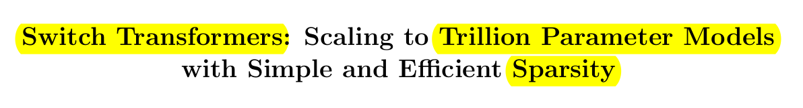
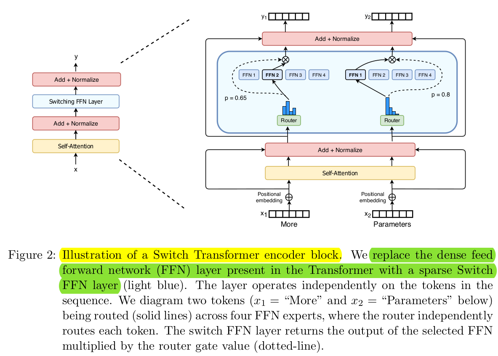

## Overview

The paper discusses a **model with a trillion parameters**, which is claimed to be significantly larger than GPT-3's 175 billion parameters. However, the comparison between the two models is debatable because the trillion parameters are not utilized in the same manner as in traditional transformers. 

The new architecture, referred to as the **Switch Transformer**, builds upon the concept of **Mixture of Experts** (MoE), a pre-existing idea. The MoE approach **involves dividing the feed-forward layer into experts**, and in this case, each token is routed to only one expert in a sparse manner.

The **Switch Transformer** takes the idea of MoE to an extreme by implementing hard routing of information, allowing **each token to be directed to a single expert per layer**. This sparse approach enables scaling of the number of experts and parameters in the model without increasing computational requirements during a forward pass. This unique architecture **allows for an increase in the model's parameters without a proportional increase in computational complexity**, making it distinct from conventional transformer models.

To **ensure stable training**, the paper introduces new techniques such as **selective dropout**, **selective casting of parameters to different precisions**, and **improved initialization**. 

Despite the catchy title of a trillion parameters, **most of the experiments in the paper are conducted with models in the order of billions of parameters**. The trillion-parameter model, while intriguing, does not perform as well as their smaller models, suggesting that working with such large models may still be challenging and resource-intensive.

The paper concludes by cautioning that trillion-parameter models may not be practical or widely adopted soon due to their complexity, cost, and potentially fuzzy performance. The comparison is made to the original ResNet paper, which presented a 1,000-layer convolutional neural network, even though contemporary ResNets typically have fewer layers. The ability to build such models is **highlighted as a demonstration of capability** rather than an immediate practical implementation.

## Performance Gains from Scale

The paper demonstrates a twofold interest: First, holding the dataset, compute, and flops constant while scaling parameters, showing a consistent decrease in loss. 
Second, the ability of switch models to outperform T5 base across various metrics, emphasizing the efficiency gains achieved by scaling up parameters.

The trade-offs discussed involve **increased memory requirements** due to more weights. However, this memory can be **efficiently distributed through sharding**, thanks to the sparsity in switch transformers. The main gains are seen in training speed, both in terms of time and the number of training steps, making the model more efficient in the super-large parameter regime.

## Switch Transformer Architecture

In a transformer, a layer consists of two main parts: **self-attention** and a **feed-forward layer**. Self-attention relates tokens within a sequence, aggregating information, while the feed-forward layer translates individual tokens to the next layer. This process happens for every token, treating them collectively as a batch of samples.

The switch transformer challenges the conventional approach of having a single feed-forward layer for all tokens. Instead, it **proposes multiple specialized feed-forward layers** that can cater to different token types, such as nouns, verbs, adjectives, or punctuation. This allows for more targeted representation translation from one layer to the next based on token characteristics.

The idea behind the switch transformer is to have several specialized feed-forward layers rather than a single universal one. This specialization is learned dynamically, **allowing the model to decide which feed-forward layer to route each token to during the translation from one layer to the next**. The routing is determined by a soft mechanism that computes routing weights based on learned queries and keys, resembling an attention mechanism.

The crucial innovation lies in the **hard routing** aspect of the switch transformer. While the routing weights are soft, indicating probabilities, **they are hard-clipped to make a definitive decision on which feed-forward layer a token should be routed to**. This hard routing means that a token goes through only one specific feed-forward layer, eliminating the need for proportional routing through multiple layers.

This hard routing mechanism is key to the switch transformer's efficiency. Unlike conventional transformers or mixture of experts models with soft routing, the switch **transformer's hard routing reduces the computation load**. This results in more efficient processing, allowing tokens to be directed to specialized feed-forward layers based on learned characteristics, ultimately improving overall model efficiency.