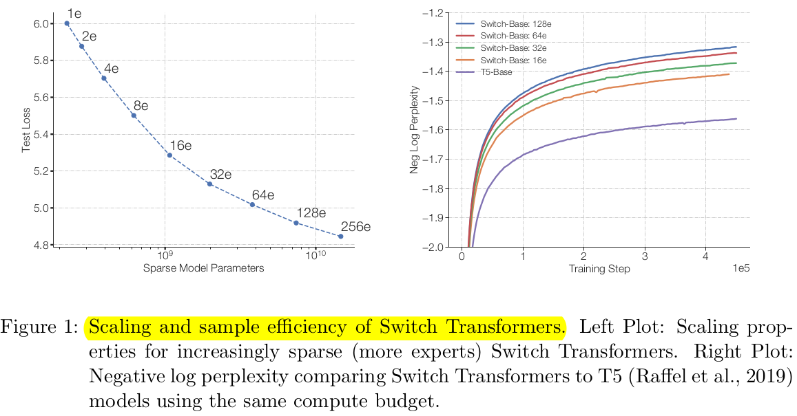

## Overview

The paper discusses a **model with a trillion parameters**, which is claimed to be significantly larger than GPT-3's 175 billion parameters. However, the comparison between the two models is debatable because the trillion parameters are not utilized in the same manner as in traditional transformers. 

The new architecture, referred to as the **Switch Transformer**, builds upon the concept of **Mixture of Experts** (MoE), a pre-existing idea. The MoE approach **involves dividing the feed-forward layer into experts**, and in this case, each token is routed to only one expert in a sparse manner.

The **Switch Transformer** takes the idea of MoE to an extreme by implementing hard routing of information, allowing **each token to be directed to a single expert per layer**. This sparse approach enables scaling of the number of experts and parameters in the model without increasing computational requirements during a forward pass. This unique architecture **allows for an increase in the model's parameters without a proportional increase in computational complexity**, making it distinct from conventional transformer models.

To **ensure stable training**, the paper introduces new techniques such as **selective dropout**, **selective casting of parameters to different precisions**, and **improved initialization**. 

Despite the catchy title of a trillion parameters, **most of the experiments in the paper are conducted with models in the order of billions of parameters**. The trillion-parameter model, while intriguing, does not perform as well as their smaller models, suggesting that working with such large models may still be challenging and resource-intensive.

The paper concludes by cautioning that trillion-parameter models may not be practical or widely adopted soon due to their complexity, cost, and potentially fuzzy performance. The comparison is made to the original ResNet paper, which presented a 1,000-layer convolutional neural network, even though contemporary ResNets typically have fewer layers. The ability to build such models is **highlighted as a demonstration of capability** rather than an immediate practical implementation.

## Performance Gains from Scale

The paper demonstrates a twofold interest: First, holding the dataset, compute, and flops constant while scaling parameters, showing a consistent decrease in loss. 
Second, the ability of switch models to outperform T5 base across various metrics, emphasizing the efficiency gains achieved by scaling up parameters.

The trade-offs discussed involve **increased memory requirements** due to more weights. However, this memory can be **efficiently distributed through sharding**, thanks to the sparsity in switch transformers. The main gains are seen in training speed, both in terms of time and the number of training steps, making the model more efficient in the super-large parameter regime.

## Switch Transformer Architecture

In a transformer, a layer consists of two main parts: **self-attention** and a **feed-forward layer**. Self-attention relates tokens within a sequence, aggregating information, while the feed-forward layer translates individual tokens to the next layer. This process happens for every token, treating them collectively as a batch of samples.

The switch transformer challenges the conventional approach of having a single feed-forward layer for all tokens. Instead, it **proposes multiple specialized feed-forward layers** that can cater to different token types, such as nouns, verbs, adjectives, or punctuation. This allows for more targeted representation translation from one layer to the next based on token characteristics.

The idea behind the switch transformer is to have several specialized feed-forward layers rather than a single universal one. This specialization is learned dynamically, **allowing the model to decide which feed-forward layer to route each token to during the translation from one layer to the next**. The routing is determined by a soft mechanism that computes routing weights based on learned queries and keys, resembling an attention mechanism.

The crucial innovation lies in the **hard routing** aspect of the switch transformer. While the routing weights are soft, indicating probabilities, **they are hard-clipped to make a definitive decision on which feed-forward layer a token should be routed to**. This hard routing means that a token goes through only one specific feed-forward layer, eliminating the need for proportional routing through multiple layers.

This hard routing mechanism is key to the switch transformer's efficiency. Unlike conventional transformers or mixture of experts models with soft routing, the switch **transformer's hard routing reduces the computation load**. This results in more efficient processing, allowing tokens to be directed to specialized feed-forward layers based on learned characteristics, ultimately improving overall model efficiency.
## Model/Data/Expert - Parallelism

In the switch transformer, utilizing argmax routing for token assignment to feed-forward layers, the number of parameters is multiplied by four. However, each token incurs only one feed-forward layer, maintaining the computation per forward pass, and this is a key efficiency factor.

This approach allows for significant scaling of the number of experts while keeping the computational load constant. Importantly, there's no need for data transfer between experts, enabling efficient sharding across multiple machines. This sharding is vital for handling the vast number of parameters in the model.

The model can be efficiently sharded using techniques like data parallelism, model parallelism, or a combination of both. Data parallelism involves distributing data to different cores, while model parallelism splits the model across cores. Switch transformer employs expert and data parallelism, where each expert processes specific data independently, minimizing communication costs and achieving scalable training.

The paper further discusses various sharding techniques, illustrating how model and data parallelism can be combined for efficient distributed training. It emphasizes the advantages of expert and data parallelism in the switch transformer, enabling the model to handle a large number of parameters while maintaining computational efficiency.

## Experimental Results

The results of the switch transformer are compared to T5 base and T5 large models, showcasing the switch model's significantly higher number of parameters (7 billion and 26 billion) compared to T5 large (less than a billion). Importantly, the number of floating-point operations per forward pass (flops) is matched for a fair comparison.

The switch transformer demonstrates remarkable improvements in speed and sample efficiency over dense models, even with the same amount of compute per forward propagation. Benchmarks on multilingual datasets reveal consistent gains in both time and the number of training steps across various languages.

While the trade-off for these gains involves the need for more machines, the largest model, Switch XXL, surpasses T5 XXXL in log perplexity and downstream tasks with more parameters and equivalent flops. Additionally, a trillion-parameter model is constructed, showing competitive performance with T5 XXXL despite fewer flops per token. However, it falls short of the Switch XXL model, emphasizing the importance of balancing parameters, heads, and layers for optimal performance. The paper concludes that having a vast number of parameters alone is not sufficient; thoughtful trade-offs are essential for achieving superior results in large language models.

## Stabilizing Training

**Selective precision**
The paper addresses model instability during training with efficient bfloat16 precision, proposing a solution of selectively casting to float32 precision within a specific model section. This approach balances stability without the communication cost associated with float32 tensors, aligning with modern mixed precision strategies. By casting the router input to float32 precision and confining its use to local computations, the paper achieves nearly equal training speed to bfloat16 while avoiding the transmission of costly float32 tensors during communication operations. This strategy retains the stability benefits of float32 precision without incurring high communication costs.

**Smaller parameter initialization**
Proper initialization is vital for successful training in deep learning, especially for the Switch Transformer. The paper advocates initializing weight matrices by sampling from a truncated normal distribution, with adjustments for scale. To counter instability, the default Transformer initialization scale is reduced by a factor of 10, significantly improving model quality and stability during training. This approach proves effective across models of different sizes, from a 223M parameter baseline to massive models exceeding one trillion parameters. The recommended initialization scheme enhances average model quality, minimizes variance across runs, and ensures stable training outcomes.

**Regularization**
The paper addresses overfitting challenges during fine-tuning in natural language processing tasks, particularly with Switch Transformers having significantly more parameters than baseline models. To mitigate overfitting, the authors propose "**expert dropout**," an approach involving increased dropout rates specifically within the experts' interim feed-forward computations. Unlike uniform dropout increases across all layers, a strategic implementation with a smaller dropout rate (0.1) at non-expert layers and a larger rate (0.4) at expert layers yields performance improvements on smaller downstream tasks. The expert dropout protocol proves effective in preventing overfitting and enhancing model performance during fine-tuning.

## Distillation

Researchers showcase the model's ability to distill knowledge into a smaller, dense model equivalent to T5 Base, surpassing T5's scratch-trained performance. The distillation process retains over 97% reduction in parameters while preserving up to 30% of the original large model's performance gains. This suggests effective knowledge transfer from the expansive sparse model to a more compact one, facilitating widespread usage.

